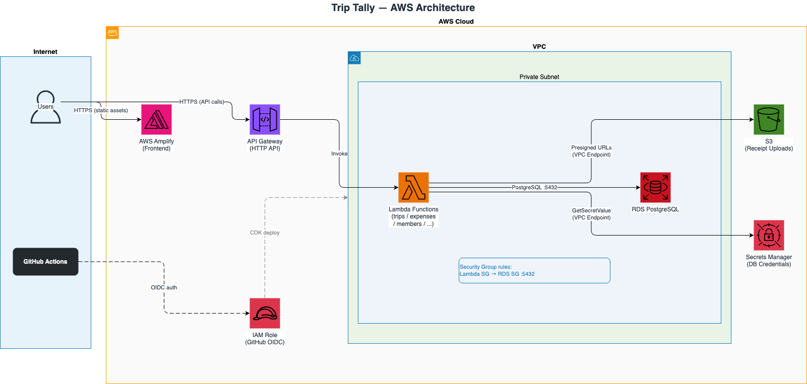

# Trip Tally

Collaborative expense tracker for trips. No sign-up required — share a link and start splitting costs instantly.

**[https://trip-tally.cornula.com](https://trip-tally.cornula.com)**

***

## Project Overview

Trip Tally is a web application that helps groups track shared expenses during trips or any shared situation. A user creates a trip, gets a unique URL, and shares it. Anyone with the link can join, add expenses, and see who owes whom — with no account or login required.

The app runs entirely on AWS serverless infrastructure (Lambda + API Gateway + RDS) and is deployed automatically from GitHub via OIDC-authenticated GitHub Actions.

***

## App Usage

1. Open the app and enter a trip name, your name, and currency
2. Share the generated trip URL with your group via any messaging app
3. Group members open the link and select their name (or add themselves)
4. Add expenses — choose who paid, the amount, and how to split (equally, exact amounts, or percentages)
5. Check the **Balances** tab to see net balances and the minimum transactions needed to settle up
6. Optionally attach receipt photos to any expense

***

## High-Level Design




**Key design decisions:**

| Decision                        | Rationale                                                              |
| ------------------------------- | ---------------------------------------------------------------------- |
| No authentication               | Frictionless access; trip UUID acts as a secret share token            |
| Serverless Lambda               | No servers to manage; scales to zero cost when idle                    |
| RDS in private subnet           | DB never exposed to the internet; Lambda connects via Security Group   |
| Integer cents for money         | Avoids floating-point drift entirely                                   |
| Settlements computed on-the-fly | Never stored; always fresh from current expense state                  |
| Static frontend (Amplify)       | No SSR server needed; all data fetching is client-side via React Query |

***

## Low-Level Design

### Database Schema

```
trips
  id (UUID PK) · name · description · currency · created_at · updated_at

members
  id (UUID PK) · trip_id (FK→trips) · name · created_at
  UNIQUE(trip_id, name)

expenses
  id (UUID PK) · trip_id (FK→trips) · paid_by_member_id (FK→members)
  title · amount (INTEGER cents) · currency · split_type (EQUAL|EXACT|PERCENTAGE)
  receipt_s3_key · created_by_member_id · created_at · updated_at

expense_splits
  id (UUID PK) · expense_id (FK→expenses) · member_id (FK→members)
  amount (INTEGER cents) · percentage (NUMERIC 5,2)
  UNIQUE(expense_id, member_id)

activity_log
  id (UUID PK) · trip_id (FK→trips) · member_id (FK→members, nullable)
  event_type · metadata (JSONB) · created_at
```

### Backend Layers

```
Lambda handler (functions/)
  └── validates input with Zod
  └── calls Service layer

Service layer (services/)
  └── business logic (split computation, balance calculation, debt simplification)
  └── calls Repository interfaces

Repository layer (repositories/)
  └── interface definitions (types.ts)
  └── PostgreSQL implementation (postgres/)
```

### Debt Simplification Algorithm

Balances are computed by summing what each member paid minus what they owe across all splits. The resulting net balances feed into a greedy algorithm:

1. Separate members into creditors (net > 0) and debtors (net < 0)
2. Sort both lists descending by absolute amount
3. Match the largest creditor against the largest debtor, emit a settlement for `min(creditor, debtor)`, and reduce both amounts
4. Advance whichever side reaches zero

This produces **at most n−1 transactions** for n members — optimal in the general case.

### Split Types

| Type         | Input                   | Computation                                                          |
| ------------ | ----------------------- | -------------------------------------------------------------------- |
| `EQUAL`      | list of participant IDs | floor(total/n) per member; remainder cents go to first members       |
| `EXACT`      | amount per member       | validated to sum exactly to total                                    |
| `PERCENTAGE` | percentage per member   | must sum to 100±0.01; converted to cents with remainder distribution |

### API Routes

| Method   | Path                                             | Description                                                           |
| -------- | ------------------------------------------------ | --------------------------------------------------------------------- |
| `POST`   | `/trips`                                         | Create trip                                                           |
| `GET`    | `/trips/:tripId`                                 | Get trip summary (trip + members + expenses + balances + settlements) |
| `PATCH`  | `/trips/:tripId`                                 | Update trip name/description                                          |
| `POST`   | `/trips/:tripId/members`                         | Add member                                                            |
| `DELETE` | `/trips/:tripId/members/:memberId`               | Remove member                                                         |
| `POST`   | `/trips/:tripId/expenses`                        | Add expense                                                           |
| `PATCH`  | `/trips/:tripId/expenses/:expenseId`             | Edit expense                                                          |
| `DELETE` | `/trips/:tripId/expenses/:expenseId`             | Delete expense                                                        |
| `POST`   | `/trips/:tripId/expenses/:expenseId/receipt-url` | Get presigned S3 upload URL                                           |
| `GET`    | `/trips/:tripId/activity`                        | Get activity feed (cursor-paginated)                                  |

### Frontend State

| State                                  | Tool                | Storage         |
| -------------------------------------- | ------------------- | --------------- |
| Server data (trips, expenses, members) | React Query         | in-memory cache |
| Current member identity per trip       | Zustand + `persist` | localStorage    |
| Recently visited trips (last 5)        | Zustand + `persist` | localStorage    |

***

## Project Structure

```
trip-tally/
├── frontend-web/                    # Next.js 14 App Router
│   └── src/
│       ├── app/
│       │   ├── page.tsx             # Home page (create trip)
│       │   └── trips/[tripId]/
│       │       └── page.tsx         # Trip detail page
│       ├── components/              # UI components
│       │   ├── AddExpenseModal.tsx
│       │   ├── EditExpenseModal.tsx
│       │   ├── ExpenseList.tsx
│       │   ├── BalanceSummary.tsx
│       │   ├── SettlementList.tsx
│       │   ├── MemberManager.tsx
│       │   ├── ActivityFeed.tsx
│       │   ├── ShareLink.tsx
│       │   └── SplitEditor.tsx
│       ├── hooks/                   # React Query hooks
│       │   ├── useTrip.ts
│       │   ├── useExpenses.ts
│       │   └── useMembers.ts
│       ├── store/
│       │   └── tripStore.ts         # Zustand store (member identity, recent trips)
│       ├── api/
│       │   └── client.ts            # Typed fetch wrapper
│       └── utils/
│           └── currency.ts          # Currency formatting helpers
│
├── backend/                         # Node.js Lambda functions
│   └── src/
│       ├── functions/               # Lambda entry points (one per resource)
│       │   ├── trips.ts
│       │   ├── expenses.ts
│       │   ├── members.ts
│       │   ├── activity.ts
│       │   ├── uploads.ts
│       │   └── migrate.ts           # One-shot DB migration Lambda
│       ├── services/                # Business logic
│       │   ├── tripService.ts
│       │   ├── expenseService.ts
│       │   ├── memberService.ts
│       │   ├── activityService.ts
│       │   ├── balanceService.ts
│       │   └── debtSimplification.ts
│       ├── repositories/            # Data access layer
│       │   ├── types.ts             # Repository interfaces
│       │   └── postgres/            # PostgreSQL implementations
│       ├── db/
│       │   ├── client.ts            # pg Pool (Secrets Manager or env vars)
│       │   └── schema.sql           # DDL
│       └── utils/
│           ├── response.ts          # Lambda response helpers
│           └── s3.ts                # Presigned URL generation
│
├── infrastructure/                  # AWS CDK (TypeScript)
│   └── lib/
│       ├── network-stack.ts         # VPC, subnets, security groups
│       ├── database-stack.ts        # RDS PostgreSQL + Lambda SG
│       ├── storage-stack.ts         # S3 bucket for receipts
│       ├── api-stack.ts             # Lambda functions + API Gateway
│       ├── frontend-stack.ts        # (legacy S3+CloudFront — replaced by Amplify)
│       └── github-oidc-stack.ts     # OIDC provider + IAM role for CI/CD
│
├── shared/
│   └── types/
│       └── index.ts                 # TypeScript types shared by frontend and backend
│
├── docs/
│   ├── architecture.drawio          # AWS architecture diagram
│   └── developer-guide.md           # Developer setup and contribution guide
│
├── .github/workflows/
│   ├── ci.yml                       # PR checks (tests, type-check, build)
│   └── deploy.yml                   # Push to main → deploy to AWS
│
├── .gitignore
└── README.md
```

***

## Tech Stack

| Layer          | Technology                                                                             |
| -------------- | -------------------------------------------------------------------------------------- |
| Frontend       | Next.js 14, React Query, Zustand, Tailwind CSS, Zod                                    |
| Backend        | Node.js 20, TypeScript, PostgreSQL (`pg`), Zod, AWS SDK v3                             |
| Infrastructure | AWS CDK, API Gateway HTTP API, Lambda, RDS PostgreSQL 15, S3, Secrets Manager, Amplify |
| CI/CD          | GitHub Actions with OIDC (no long-lived AWS credentials)())                            |
